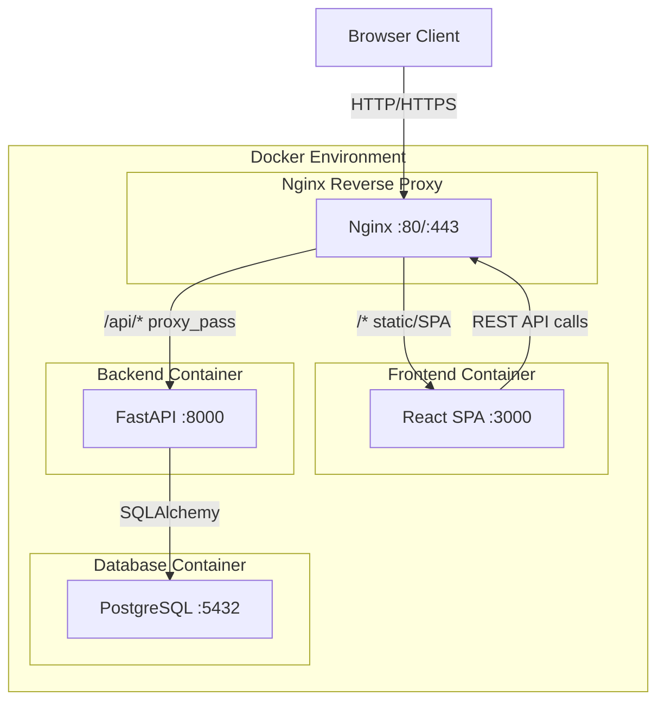
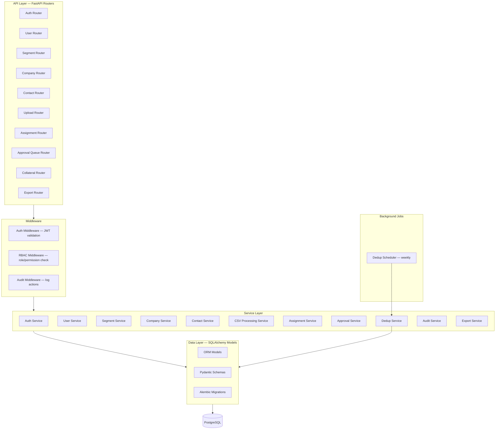
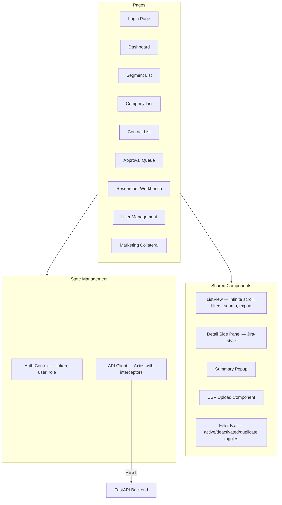
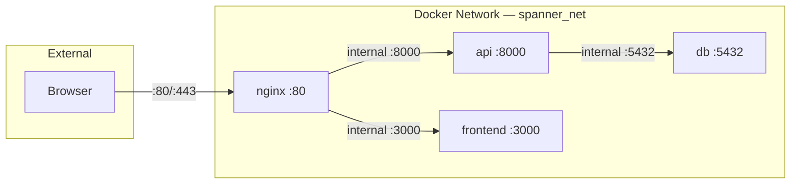
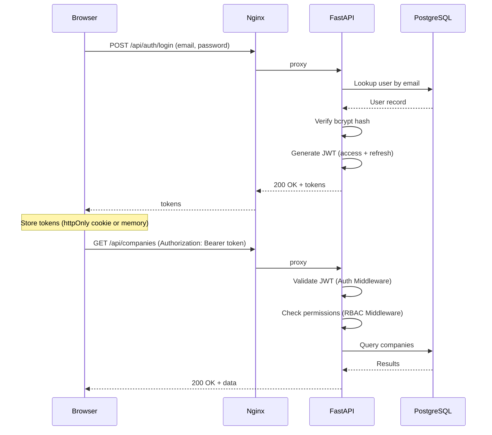
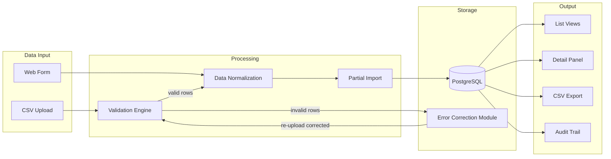

# Spanner — System Architecture

**Document Version:** 1.0  
**Last Updated:** 2026-02-14  
**Source:** `requirements.md` v3.1

---

## 1. Technology Stack

| Layer | Technology | Version (Recommended) | Notes |
|-------|-----------|----------------------|-------|
| **Backend** | Python + FastAPI | Python 3.12, FastAPI 0.110+ | API-first, async support |
| **ORM** | SQLAlchemy + Alembic | SQLAlchemy 2.0, Alembic 1.13+ | Async ORM, migration management |
| **Database** | PostgreSQL | 16.x | Separate Docker container |
| **Frontend** | React | 18.x | SPA, communicates via REST API |
| **HTTP Client** | Axios or Fetch API | — | Frontend → Backend |
| **Auth** | JWT (access + refresh tokens) | python-jose / PyJWT | Token-based API auth |
| **Password Hashing** | bcrypt | passlib[bcrypt] | Secure password storage |
| **CSV Processing** | Python csv / pandas | stdlib or pandas 2.x | Validation + partial import |
| **Task Scheduling** | APScheduler or Celery | — | Dedup scheduled job |
| **Containerization** | Docker + Docker Compose | Docker 25+, Compose v2 | All components containerized |
| **Reverse Proxy** | Nginx | 1.25+ | Route frontend/API, serve static |

---

## 2. Container Diagram

High-level view of all Docker containers and their interactions.

### Container Responsibilities

| Container | Image | Port | Purpose |
|-----------|-------|------|---------|
| **nginx** | nginx:1.25-alpine | 80, 443 | Reverse proxy, route `/api/*` to backend, serve frontend |
| **frontend** | node:20-alpine (build) | 3000 (dev) | React SPA — UI layer |
| **backend** | python:3.12-slim | 8000 | FastAPI — REST API, business logic, CSV processing |
| **db** | postgres:16-alpine | 5432 | PostgreSQL — persistent data storage |

---

## 3. Component Diagram (Backend)

Internal structure of the FastAPI backend application.

---

## 4. Component Diagram (Frontend)

Internal structure of the React frontend application.

---

## 5. Network Topology

- Only **Nginx** exposes ports to the host
- Backend, frontend, and database communicate on an **internal Docker network**
- PostgreSQL is **not exposed** to the host (access via backend only)

---

## 6. Security Architecture

### 6.1 Authentication Flow

### 6.2 Security Measures

| Area | Approach |
|------|----------|
| **Password storage** | bcrypt via passlib; min 12 rounds |
| **Token format** | JWT (access: 30 min, refresh: 7 days) |
| **Token storage** | httpOnly cookie (preferred) or in-memory |
| **RBAC enforcement** | Middleware checks role + permission before every request |
| **Admin-only signup** | `/api/users` POST restricted to Admin role |
| **Input validation** | Pydantic schemas on all endpoints |
| **CORS** | Restrict origins to frontend domain |
| **File upload** | Max 10MB, `.csv` only, UTF-8 validation |
| **SQL injection** | ORM (SQLAlchemy) — parameterized queries |
| **Rate limiting** | Optional — recommended on auth endpoints |

---

## 7. Data Flow Overview

---

## 8. Deployment Considerations

| Concern | Approach |
|---------|----------|
| **Environment config** | `.env` file per environment; Docker Compose env_file |
| **Database migrations** | Alembic — run on container startup |
| **Logging** | Structured JSON logs; stdout (Docker captures) |
| **Health checks** | `/api/health` endpoint; Docker HEALTHCHECK |
| **Backups** | PostgreSQL pg_dump scheduled job (outside app scope) |
| **Scaling** | Single-tenant; single instance sufficient for expected volumes |
