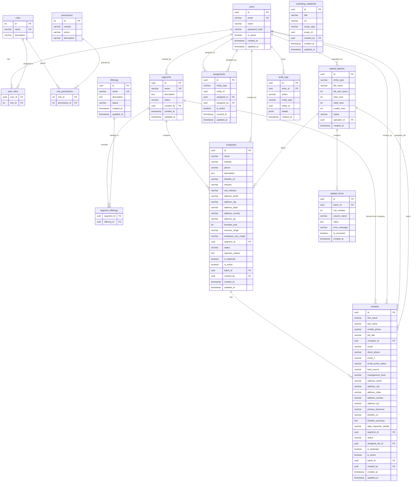

# Spanner — Database Design

**Document Version:** 1.0  
**Last Updated:** 2026-02-14  
**Source:** `requirements.md` v3.1  
**Database:** PostgreSQL 16

---

## 1. Entity-Relationship Diagram



---

## 2. Table Definitions

### 2.1 `users`

| Column | Type | Nullable | Default | Constraint |
|--------|------|----------|---------|------------|
| id | UUID | No | gen_random_uuid() | PK |
| email | VARCHAR(255) | No | — | UNIQUE |
| name | VARCHAR(255) | No | — | |
| password_hash | VARCHAR(255) | No | — | |
| is_active | BOOLEAN | No | true | |
| created_at | TIMESTAMP WITH TZ | No | now() | |
| updated_at | TIMESTAMP WITH TZ | No | now() | |

### 2.2 `roles`

| Column | Type | Nullable | Default | Constraint |
|--------|------|----------|---------|------------|
| id | SERIAL | No | auto | PK |
| name | VARCHAR(50) | No | — | UNIQUE |
| description | VARCHAR(255) | Yes | — | |

**Seed data:** Admin, Segment Owner, Researcher, Approver, SDR, Marketing

### 2.3 `user_roles`

| Column | Type | Nullable | Constraint |
|--------|------|----------|------------|
| user_id | UUID | No | FK → users.id, PK (composite) |
| role_id | INT | No | FK → roles.id, PK (composite) |

### 2.4 `permissions`

| Column | Type | Nullable | Default | Constraint |
|--------|------|----------|---------|------------|
| id | SERIAL | No | auto | PK |
| module | VARCHAR(100) | No | — | |
| action | VARCHAR(100) | No | — | |
| description | VARCHAR(255) | Yes | — | |

**Unique constraint:** (module, action)

**Example rows:**

| module | action | description |
|--------|--------|-------------|
| segments | create | Create new segment |
| segments | archive | Archive a segment |
| companies | approve | Approve a pending company |
| companies | reject | Reject a pending company |
| companies | upload_csv | Upload company CSV |
| contacts | approve | Approve uploaded contacts |
| contacts | assign | Assign contact to SDR |
| contacts | upload_csv | Upload contact CSV |
| users | manage | Create/edit/deactivate users |

### 2.5 `role_permissions`

| Column | Type | Nullable | Constraint |
|--------|------|----------|------------|
| role_id | INT | No | FK → roles.id, PK (composite) |
| permission_id | INT | No | FK → permissions.id, PK (composite) |

### 2.6 `segments`

| Column | Type | Nullable | Default | Constraint |
|--------|------|----------|---------|------------|
| id | UUID | No | gen_random_uuid() | PK |
| name | VARCHAR(255) | No | — | UNIQUE |
| description | TEXT | Yes | — | |
| status | VARCHAR(20) | No | 'active' | CHECK (active, archived) |
| created_by | UUID | No | — | FK → users.id |
| created_at | TIMESTAMP WITH TZ | No | now() | |
| updated_at | TIMESTAMP WITH TZ | No | now() | |

### 2.7 `offerings`

| Column | Type | Nullable | Default | Constraint |
|--------|------|----------|---------|------------|
| id | UUID | No | gen_random_uuid() | PK |
| name | VARCHAR(255) | No | — | UNIQUE |
| description | TEXT | Yes | — | |
| status | VARCHAR(20) | No | 'active' | CHECK (active, inactive) |
| created_at | TIMESTAMP WITH TZ | No | now() | |
| updated_at | TIMESTAMP WITH TZ | No | now() | |

### 2.8 `segment_offerings`

| Column | Type | Nullable | Constraint |
|--------|------|----------|------------|
| segment_id | UUID | No | FK → segments.id, PK (composite) |
| offering_id | UUID | No | FK → offerings.id, PK (composite) |

### 2.9 `companies`

| Column | Type | Nullable | Default | Constraint |
|--------|------|----------|---------|------------|
| id | UUID | No | gen_random_uuid() | PK |
| name | VARCHAR(500) | No | — | |
| website | VARCHAR(500) | Yes | — | |
| phone | VARCHAR(50) | Yes | — | |
| description | TEXT | Yes | — | |
| linkedin_url | VARCHAR(500) | Yes | — | |
| industry | VARCHAR(200) | Yes | — | |
| sub_industry | VARCHAR(200) | Yes | — | |
| address_street | VARCHAR(500) | Yes | — | |
| address_city | VARCHAR(200) | Yes | — | |
| address_state | VARCHAR(200) | Yes | — | |
| address_country | VARCHAR(200) | Yes | — | |
| address_zip | VARCHAR(50) | Yes | — | |
| founded_year | INT | Yes | — | CHECK (1800–current year) |
| revenue_range | VARCHAR(200) | Yes | — | |
| employee_size_range | VARCHAR(200) | Yes | — | |
| segment_id | UUID | No | — | FK → segments.id |
| status | VARCHAR(20) | No | 'pending' | CHECK (pending, approved, rejected) |
| rejection_reason | TEXT | Yes | — | Required when status = rejected |
| is_duplicate | BOOLEAN | No | false | |
| is_active | BOOLEAN | No | true | |
| batch_id | UUID | Yes | — | FK → upload_batches.id |
| created_by | UUID | No | — | FK → users.id |
| created_at | TIMESTAMP WITH TZ | No | now() | |
| updated_at | TIMESTAMP WITH TZ | No | now() | |

**Dedup composite index:** (name, website, segment_id) — used by dedup job; cross-segment duplicates are intentional.

### 2.10 `contacts`

| Column | Type | Nullable | Default | Constraint |
|--------|------|----------|---------|------------|
| id | UUID | No | gen_random_uuid() | PK |
| first_name | VARCHAR(200) | No | — | |
| last_name | VARCHAR(200) | No | — | |
| mobile_phone | VARCHAR(50) | Yes | — | |
| job_title | VARCHAR(500) | Yes | — | |
| company_id | UUID | No | — | FK → companies.id |
| email | VARCHAR(255) | No | — | |
| direct_phone | VARCHAR(50) | Yes | — | |
| email_2 | VARCHAR(255) | Yes | — | |
| email_active_status | VARCHAR(100) | Yes | — | |
| lead_source | VARCHAR(200) | Yes | — | |
| management_level | VARCHAR(200) | Yes | — | |
| address_street | VARCHAR(500) | Yes | — | |
| address_city | VARCHAR(200) | Yes | — | |
| address_state | VARCHAR(200) | Yes | — | |
| address_country | VARCHAR(200) | Yes | — | |
| address_zip | VARCHAR(50) | Yes | — | |
| primary_timezone | VARCHAR(100) | Yes | — | |
| linkedin_url | VARCHAR(500) | Yes | — | |
| linkedin_summary | TEXT | Yes | — | |
| data_requester_details | VARCHAR(500) | Yes | — | |
| segment_id | UUID | No | — | FK → segments.id (derived from company) |
| status | VARCHAR(30) | No | 'uploaded' | CHECK (uploaded, approved, assigned_to_sdr, meeting_scheduled) |
| assigned_sdr_id | UUID | Yes | — | FK → users.id |
| is_duplicate | BOOLEAN | No | false | |
| is_active | BOOLEAN | No | true | |
| batch_id | UUID | Yes | — | FK → upload_batches.id |
| created_by | UUID | No | — | FK → users.id |
| created_at | TIMESTAMP WITH TZ | No | now() | |
| updated_at | TIMESTAMP WITH TZ | No | now() | |

**Dedup composite index:** (email, company_id) — recommended dedup key.

### 2.11 `assignments`

| Column | Type | Nullable | Default | Constraint |
|--------|------|----------|---------|------------|
| id | UUID | No | gen_random_uuid() | PK |
| entity_type | VARCHAR(50) | No | — | CHECK (segment, company, contact) |
| entity_id | UUID | No | — | |
| assigned_to | UUID | No | — | FK → users.id |
| assigned_by | UUID | No | — | FK → users.id |
| is_active | BOOLEAN | No | true | |
| created_at | TIMESTAMP WITH TZ | No | now() | |
| updated_at | TIMESTAMP WITH TZ | No | now() | |

**Unique constraint:** (entity_type, entity_id, assigned_to) — prevent duplicate assignments.

### 2.12 `upload_batches`

| Column | Type | Nullable | Default | Constraint |
|--------|------|----------|---------|------------|
| id | UUID | No | gen_random_uuid() | PK |
| entity_type | VARCHAR(20) | No | — | CHECK (company, contact) |
| file_name | VARCHAR(500) | No | — | |
| file_size_bytes | INT | No | — | |
| total_rows | INT | No | 0 | |
| valid_rows | INT | No | 0 | |
| invalid_rows | INT | No | 0 | |
| status | VARCHAR(20) | No | 'processing' | CHECK (processing, completed, failed) |
| uploader_id | UUID | No | — | FK → users.id |
| created_at | TIMESTAMP WITH TZ | No | now() | |

### 2.13 `upload_errors`

| Column | Type | Nullable | Default | Constraint |
|--------|------|----------|---------|------------|
| id | UUID | No | gen_random_uuid() | PK |
| batch_id | UUID | No | — | FK → upload_batches.id |
| row_number | INT | No | — | |
| column_name | VARCHAR(200) | No | — | |
| value | TEXT | Yes | — | |
| error_message | VARCHAR(500) | No | — | |
| is_corrected | BOOLEAN | No | false | |
| created_at | TIMESTAMP WITH TZ | No | now() | |

### 2.14 `audit_logs`

| Column | Type | Nullable | Default | Constraint |
|--------|------|----------|---------|------------|
| id | UUID | No | gen_random_uuid() | PK |
| actor_id | UUID | No | — | FK → users.id |
| action | VARCHAR(100) | No | — | e.g. create, approve, reject, assign, upload, edit |
| entity_type | VARCHAR(50) | No | — | e.g. company, contact, segment, user |
| entity_id | UUID | No | — | |
| details | JSONB | Yes | — | Additional context (old/new values, reason, etc.) |
| created_at | TIMESTAMP WITH TZ | No | now() | |

**Note:** Append-only table. No updates or deletes.

### 2.15 `marketing_collaterals`

| Column | Type | Nullable | Default | Constraint |
|--------|------|----------|---------|------------|
| id | UUID | No | gen_random_uuid() | PK |
| title | VARCHAR(500) | No | — | |
| url | VARCHAR(1000) | No | — | SharePoint / share drive URL |
| scope_type | VARCHAR(50) | No | — | CHECK (segment, offering, lead) |
| scope_id | UUID | No | — | Polymorphic reference |
| created_by | UUID | No | — | FK → users.id |
| created_at | TIMESTAMP WITH TZ | No | now() | |
| updated_at | TIMESTAMP WITH TZ | No | now() | |

---

## 3. Indexes

### 3.1 Primary & Unique Indexes (automatic)
- All PK columns (auto-indexed)
- users.email (UNIQUE)
- roles.name (UNIQUE)
- segments.name (UNIQUE)
- offerings.name (UNIQUE)
- permissions (module, action) (UNIQUE)
- assignments (entity_type, entity_id, assigned_to) (UNIQUE)

### 3.2 Foreign Key Indexes

| Table | Index Columns | Purpose |
|-------|--------------|---------|
| companies | segment_id | Filter by segment |
| companies | created_by | Filter by researcher |
| companies | batch_id | Filter by upload batch |
| contacts | company_id | Filter by company |
| contacts | segment_id | Filter by segment |
| contacts | assigned_sdr_id | Filter by SDR |
| contacts | created_by | Filter by researcher |
| contacts | batch_id | Filter by upload batch |
| assignments | entity_type, entity_id | Lookup assignments for entity |
| assignments | assigned_to | Lookup user's assignments |
| upload_errors | batch_id | Errors for a batch |
| audit_logs | entity_type, entity_id | Activity timeline per record |
| audit_logs | actor_id | Actions by a user |

### 3.3 Query Performance Indexes

| Table | Index Columns | Purpose |
|-------|--------------|---------|
| companies | status | Filter by status (approval queue) |
| companies | is_duplicate, is_active | Default list filters |
| companies | name, website, segment_id | Dedup composite key |
| companies | created_at | Sort by date |
| contacts | status | Filter by status (approval queue) |
| contacts | is_duplicate, is_active | Default list filters |
| contacts | email, company_id | Dedup composite key |
| contacts | created_at | Sort by date |
| segments | status | Filter active/archived |
| audit_logs | created_at | Timeline ordering |

---

## 4. Key Relationships Summary

```
users ──┬── user_roles ──── roles ──── role_permissions ──── permissions
        ├── segments (created_by)
        ├── companies (created_by)
        ├── contacts (created_by, assigned_sdr)
        ├── assignments (assigned_to, assigned_by)
        ├── upload_batches (uploader)
        └── audit_logs (actor)

segments ──┬── segment_offerings ──── offerings
           ├── companies (segment_id)  ← ONE company record per segment
           └── contacts (segment_id)   ← derived from company

companies ──── contacts (company_id)

upload_batches ──┬── companies (batch_id)
                 ├── contacts (batch_id)
                 └── upload_errors (batch_id)
```

---

## 5. Alembic Migration Strategy

1. **Initial migration:** Create all tables, constraints, indexes
2. **Seed data:** Insert roles (6), initial permissions, admin user
3. **Convention:** One migration per feature/change; descriptive names
4. **Run on startup:** `alembic upgrade head` in Docker entrypoint

---

## 6. Data Integrity Rules

| Rule | Implementation |
|------|---------------|
| Company rejection requires reason | Application-level check (API validates rejection_reason when status = rejected) |
| Contact segment derived from company | Application-level: set contact.segment_id = company.segment_id on insert |
| Dedup does not cross segments | Dedup job WHERE clause includes segment_id |
| Audit logs are append-only | No UPDATE/DELETE permissions on audit_logs table |
| Soft delete only | `is_active` flag; no physical deletes |
| Password never exposed | password_hash excluded from all query results / Pydantic response schemas |
