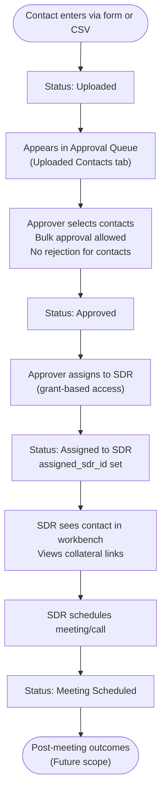

# Spanner — Process Flows

**Document Version:** 1.0  
**Last Updated:** 2026-02-14  
**Source:** `requirements.md` v3.1

---

## 1. End-to-End Business Flow

The complete lifecycle from segment planning to SDR outreach.


---

## 2. CSV Upload & Validation Pipeline

Applies to both Company CSV and Contact CSV uploads.


---

## 3. Company Approval Workflow


---

## 4. Contact Status Pipeline


### Contact Pipeline — Detailed



---

## 5. Company Status State Diagram


---

## 6. Contact Status State Diagram


---

## 7. Assignment Flow


---

## 8. Duplicate Detection Flow


---

## 9. User Authentication Flow


---

## 10. Researcher Workbench Flow

```mermaid
flowchart TD
    Login([Researcher logs in]) --> Workbench["Researcher Workbench"]
    Workbench --> MySegments["My Segments\n(assigned segments list)"]
    MySegments --> SelectSegment["Select a segment"]
    SelectSegment --> ApprovedCompanies["View approved companies\nin this segment"]
    ApprovedCompanies --> AddContact{Add contacts?}

    AddContact -->|"Single"| ContactForm["Create contact via form\nFor one approved company"]
    AddContact -->|"Bulk"| ContactCSV["Upload contact CSV\nFor approved companies"]

    ContactForm --> ContactCreated["Contact created\nStatus: Uploaded"]
    ContactCSV --> CSVPipeline["CSV validation pipeline\n(see Section 2)"]
    CSVPipeline --> ContactCreated

    Workbench --> MyUploads["My Uploads\n(companies + contacts by status)"]
    MyUploads --> FilterByStatus["Filter: Pending, Approved,\nRejected, Uploaded, etc."]
