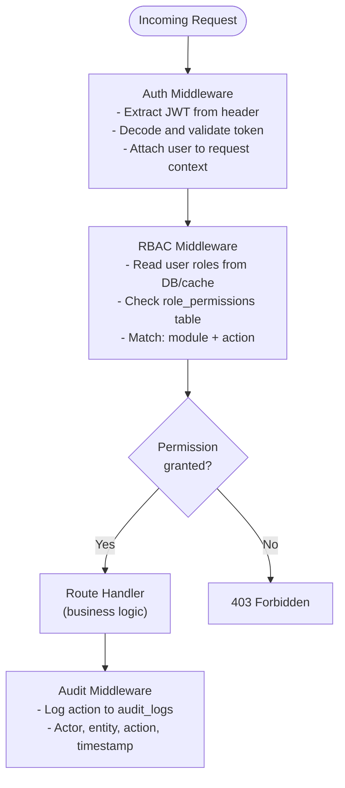
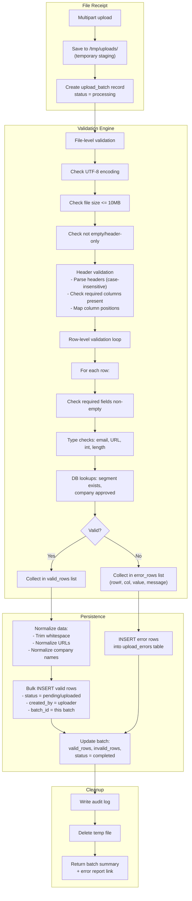
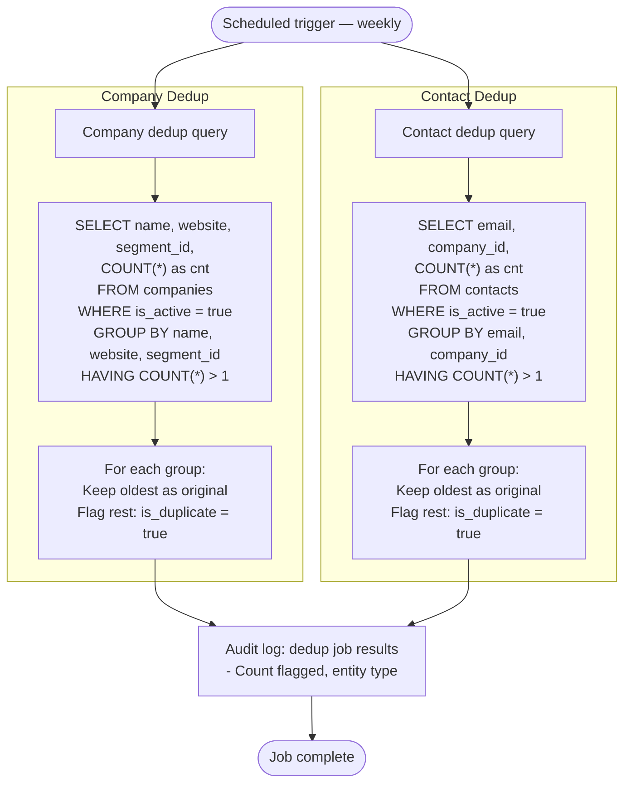
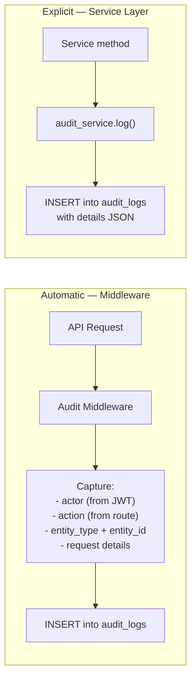
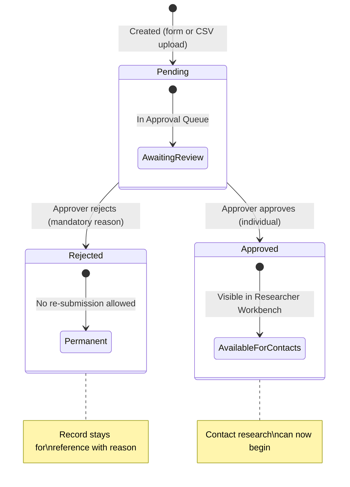
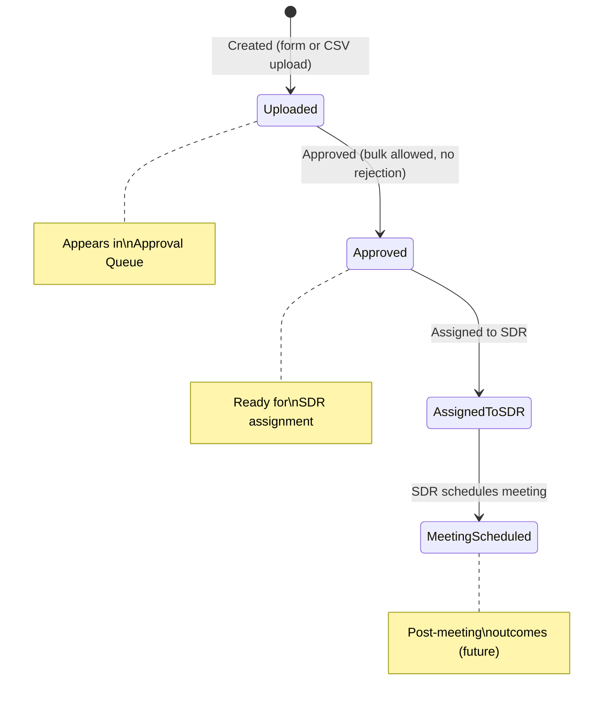
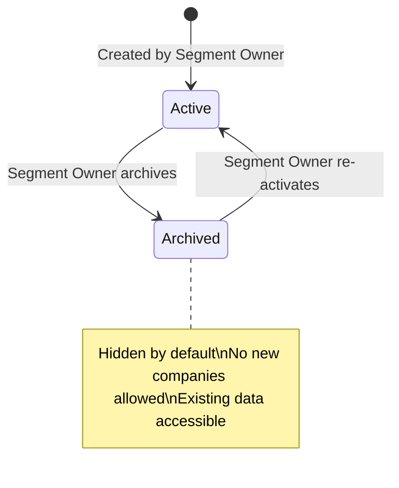
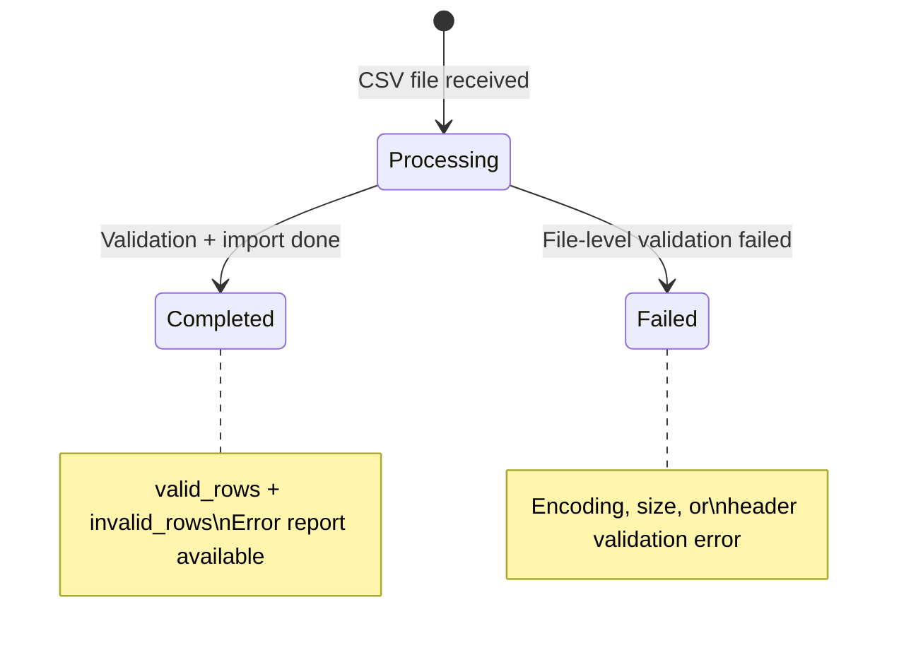

# Spanner — Technical Design

**Document Version:** 1.0  
**Last Updated:** 2026-02-14  
**Source:** `requirements.md` v3.1

---

## 1. Project Structure

### 1.1 Backend (FastAPI)

```
backend/
├── alembic/                    # Database migrations
│   ├── versions/               # Migration files
│   └── env.py
├── app/
│   ├── __init__.py
│   ├── main.py                 # FastAPI app, middleware, startup
│   ├── config.py               # Settings (from env vars)
│   ├── database.py             # SQLAlchemy engine, session
│   │
│   ├── models/                 # SQLAlchemy ORM models
│   │   ├── __init__.py
│   │   ├── user.py             # User, Role, UserRole, Permission, RolePermission
│   │   ├── segment.py          # Segment, Offering, SegmentOffering
│   │   ├── company.py          # Company
│   │   ├── contact.py          # Contact
│   │   ├── assignment.py       # Assignment
│   │   ├── upload.py           # UploadBatch, UploadError
│   │   ├── audit.py            # AuditLog
│   │   └── collateral.py       # MarketingCollateral
│   │
│   ├── schemas/                # Pydantic request/response schemas
│   │   ├── __init__.py
│   │   ├── auth.py
│   │   ├── user.py
│   │   ├── segment.py
│   │   ├── company.py
│   │   ├── contact.py
│   │   ├── assignment.py
│   │   ├── upload.py
│   │   ├── audit.py
│   │   └── collateral.py
│   │
│   ├── routers/                # FastAPI route handlers
│   │   ├── __init__.py
│   │   ├── auth.py
│   │   ├── users.py
│   │   ├── segments.py
│   │   ├── companies.py
│   │   ├── contacts.py
│   │   ├── uploads.py
│   │   ├── assignments.py
│   │   ├── approval_queue.py
│   │   ├── collaterals.py
│   │   ├── exports.py
│   │   ├── workbench.py
│   │   ├── audit_logs.py
│   │   └── health.py
│   │
│   ├── services/               # Business logic
│   │   ├── __init__.py
│   │   ├── auth_service.py
│   │   ├── user_service.py
│   │   ├── segment_service.py
│   │   ├── company_service.py
│   │   ├── contact_service.py
│   │   ├── csv_service.py      # CSV validation + import engine
│   │   ├── assignment_service.py
│   │   ├── approval_service.py
│   │   ├── dedup_service.py    # Duplicate detection logic
│   │   ├── audit_service.py
│   │   ├── export_service.py
│   │   └── collateral_service.py
│   │
│   ├── middleware/              # Request middleware
│   │   ├── __init__.py
│   │   ├── auth.py             # JWT validation
│   │   ├── rbac.py             # Role/permission enforcement
│   │   └── audit.py            # Auto audit logging
│   │
│   ├── utils/                  # Shared utilities
│   │   ├── __init__.py
│   │   ├── security.py         # bcrypt, JWT helpers
│   │   ├── validators.py       # Email, URL, phone validators
│   │   ├── normalizers.py      # Data normalization (trim, case, URL)
│   │   ├── pagination.py       # Cursor-based pagination helpers
│   │   └── csv_validators.py   # CSV-specific validation rules
│   │
│   └── jobs/                   # Scheduled background jobs
│       ├── __init__.py
│       ├── scheduler.py        # APScheduler setup
│       └── dedup_job.py        # Weekly duplicate detection
│
├── tests/                      # pytest test suite
│   ├── conftest.py
│   ├── test_auth.py
│   ├── test_companies.py
│   ├── test_contacts.py
│   ├── test_csv_upload.py
│   └── ...
│
├── requirements.txt
├── Dockerfile
└── alembic.ini
```

### 1.2 Frontend (React)

```
frontend/
├── public/
│   └── index.html
├── src/
│   ├── index.tsx
│   ├── App.tsx                 # Root component, routing
│   │
│   ├── api/                    # API client layer
│   │   ├── client.ts           # Axios instance, interceptors
│   │   ├── auth.ts
│   │   ├── users.ts
│   │   ├── segments.ts
│   │   ├── companies.ts
│   │   ├── contacts.ts
│   │   ├── uploads.ts
│   │   ├── assignments.ts
│   │   └── collaterals.ts
│   │
│   ├── contexts/               # React Context providers
│   │   ├── AuthContext.tsx      # Token, user, roles
│   │   └── NotificationContext.tsx
│   │
│   ├── hooks/                  # Custom hooks
│   │   ├── useAuth.ts
│   │   ├── useInfiniteScroll.ts
│   │   ├── useFilters.ts
│   │   └── useDebounce.ts
│   │
│   ├── pages/                  # Page-level components
│   │   ├── Login.tsx
│   │   ├── Dashboard.tsx
│   │   ├── segments/
│   │   │   ├── SegmentList.tsx
│   │   │   └── SegmentForm.tsx
│   │   ├── companies/
│   │   │   ├── CompanyList.tsx
│   │   │   └── CompanyDetail.tsx
│   │   ├── contacts/
│   │   │   ├── ContactList.tsx
│   │   │   └── ContactDetail.tsx
│   │   ├── approval/
│   │   │   └── ApprovalQueue.tsx
│   │   ├── workbench/
│   │   │   └── ResearcherWorkbench.tsx
│   │   ├── uploads/
│   │   │   └── CSVUpload.tsx
│   │   ├── users/
│   │   │   └── UserManagement.tsx
│   │   └── collaterals/
│   │       └── CollateralList.tsx
│   │
│   ├── components/             # Shared/reusable components
│   │   ├── layout/
│   │   │   ├── AppShell.tsx    # Sidebar + header + content
│   │   │   ├── Sidebar.tsx
│   │   │   └── Header.tsx
│   │   ├── ListView.tsx        # Generic list: infinite scroll, search, filters
│   │   ├── FilterBar.tsx       # Filter controls (status, active/duplicate toggle)
│   │   ├── DetailPanel.tsx     # Jira-style side panel
│   │   ├── SummaryPopup.tsx    # Quick-view popup
│   │   ├── CSVUploader.tsx     # File upload + progress + error display
│   │   ├── StatusBadge.tsx     # Color-coded status pills
│   │   ├── ActivityTimeline.tsx # Audit history per record
│   │   └── ProtectedRoute.tsx  # Role-based route guard
│   │
│   ├── types/                  # TypeScript type definitions
│   │   ├── api.ts              # API response types
│   │   ├── models.ts           # Entity types
│   │   └── auth.ts             # Auth types
│   │
│   └── utils/
│       ├── formatters.ts       # Date, currency formatters
│       └── constants.ts        # Status enums, roles
│
├── package.json
├── tsconfig.json
├── Dockerfile
└── nginx.conf                  # For production build serving
```

---

## 2. Docker Compose

```yaml
# docker-compose.yml
version: "3.9"

services:
  db:
    image: postgres:16-alpine
    container_name: spanner-db
    restart: unless-stopped
    environment:
      POSTGRES_DB: ${DB_NAME:-spanner}
      POSTGRES_USER: ${DB_USER:-spanner}
      POSTGRES_PASSWORD: ${DB_PASSWORD:?required}
    volumes:
      - postgres_data:/var/lib/postgresql/data
    ports:
      - "5432"  # internal only (no host mapping by default)
    healthcheck:
      test: ["CMD-SHELL", "pg_isready -U ${DB_USER:-spanner}"]
      interval: 10s
      timeout: 5s
      retries: 5
    networks:
      - spanner_net

  api:
    build:
      context: ./backend
      dockerfile: Dockerfile
    container_name: spanner-api
    restart: unless-stopped
    depends_on:
      db:
        condition: service_healthy
    environment:
      DATABASE_URL: postgresql+asyncpg://${DB_USER:-spanner}:${DB_PASSWORD}@db:5432/${DB_NAME:-spanner}
      SECRET_KEY: ${SECRET_KEY:?required}
      ACCESS_TOKEN_EXPIRE_MINUTES: ${ACCESS_TOKEN_EXPIRE_MINUTES:-30}
      REFRESH_TOKEN_EXPIRE_DAYS: ${REFRESH_TOKEN_EXPIRE_DAYS:-7}
      CORS_ORIGINS: ${CORS_ORIGINS:-http://localhost:3000}
      MAX_UPLOAD_SIZE_MB: ${MAX_UPLOAD_SIZE_MB:-10}
    volumes:
      - upload_temp:/tmp/uploads  # Temporary CSV staging
    ports:
      - "8000"  # internal only
    healthcheck:
      test: ["CMD", "curl", "-f", "http://localhost:8000/api/health"]
      interval: 30s
      timeout: 10s
      retries: 3
    networks:
      - spanner_net

  frontend:
    build:
      context: ./frontend
      dockerfile: Dockerfile
    container_name: spanner-frontend
    restart: unless-stopped
    environment:
      REACT_APP_API_URL: /api
    ports:
      - "3000"  # internal only
    networks:
      - spanner_net

  nginx:
    image: nginx:1.25-alpine
    container_name: spanner-nginx
    restart: unless-stopped
    depends_on:
      - api
      - frontend
    ports:
      - "${HOST_PORT:-80}:80"
    volumes:
      - ./nginx/nginx.conf:/etc/nginx/conf.d/default.conf:ro
    networks:
      - spanner_net

volumes:
  postgres_data:
  upload_temp:

networks:
  spanner_net:
    driver: bridge
```

### Nginx Configuration

```nginx
# nginx/nginx.conf
upstream api_backend {
    server api:8000;
}

upstream frontend_app {
    server frontend:3000;
}

server {
    listen 80;
    server_name _;

    client_max_body_size 12M;  # Slightly above 10MB CSV limit

    # API routes
    location /api/ {
        proxy_pass http://api_backend;
        proxy_set_header Host $host;
        proxy_set_header X-Real-IP $remote_addr;
        proxy_set_header X-Forwarded-For $proxy_add_x_forwarded_for;
        proxy_set_header X-Forwarded-Proto $scheme;

        # Larger timeout for CSV uploads
        proxy_read_timeout 120s;
        proxy_send_timeout 120s;
    }

    # Frontend (SPA)
    location / {
        proxy_pass http://frontend_app;
        proxy_set_header Host $host;
        proxy_set_header X-Real-IP $remote_addr;

        # SPA fallback
        try_files $uri $uri/ /index.html;
    }
}
```

---

## 3. RBAC Implementation

### 3.1 Architecture



### 3.2 Permission Check — Pseudocode

```python
# middleware/rbac.py

from functools import wraps

def require_permission(module: str, action: str):
    """Decorator for route handlers."""
    def decorator(func):
        @wraps(func)
        async def wrapper(request, *args, **kwargs):
            user = request.state.user  # Set by auth middleware

            # Fetch user's permissions (cached per request)
            permissions = await get_user_permissions(user.id)

            # Check if user has the required module + action
            required = f"{module}:{action}"
            if required not in permissions:
                raise HTTPException(status_code=403, detail="Insufficient permissions")

            return await func(request, *args, **kwargs)
        return wrapper
    return decorator


# Usage in router:
@router.post("/companies/{id}/approve")
@require_permission("companies", "approve")
async def approve_company(id: UUID, request: Request, db: AsyncSession = Depends(get_db)):
    ...
```

### 3.3 Default Role-Permission Matrix

| Permission | Admin | Seg. Owner | Researcher | Approver | SDR | Marketing |
|-----------|-------|-----------|-----------|---------|-----|----------|
| users:manage | x | | | | | |
| segments:create | | x | | | | |
| segments:archive | | x | | | | |
| segments:read | x | x | x | x | x | x |
| companies:create | | | x | x | | |
| companies:read | x | x | x | x | x | |
| companies:edit | | | x | x | | |
| companies:approve | | | | x | x* | |
| companies:reject | | | | x | x* | |
| companies:upload_csv | | | x | x | | |
| contacts:create | | | x | x | | |
| contacts:read | x | x | x | x | x | |
| contacts:edit | | | x | x | | |
| contacts:approve | | | | x | x* | |
| contacts:assign | | | | x | | |
| contacts:upload_csv | | | x | x | | |
| contacts:schedule_meeting | | | | | x | |
| assignments:create | | x | | x | | |
| collaterals:manage | | | | | | x |
| exports:companies | x | x | x | x | x | |
| exports:contacts | x | x | x | x | x | |
| audit:read_global | x | | | | | |
| uploads:read | | | x | x | | |

*Grant-based: configurable by admin per deployment.*

---

## 4. CSV Processing Engine

### 4.1 Architecture



### 4.2 Validation Rules — Implementation

```python
# services/csv_service.py (pseudocode)

class CSVValidator:
    def __init__(self, entity_type: str, db: AsyncSession):
        self.entity_type = entity_type  # "company" or "contact"
        self.db = db
        self.schema = COMPANY_SCHEMA if entity_type == "company" else CONTACT_SCHEMA
        self.errors = []
        self.valid_rows = []

    async def validate_file(self, file_path: str) -> BatchResult:
        # 1. File-level checks
        self._check_encoding(file_path)      # UTF-8
        self._check_size(file_path)           # <= 10MB
        self._check_not_empty(file_path)      # Has data rows

        # 2. Parse headers
        headers = self._parse_headers(file_path)  # Case-insensitive
        self._validate_required_columns(headers)

        # 3. Row-level validation
        for row_num, row in self._iter_rows(file_path, headers):
            row_errors = await self._validate_row(row_num, row)
            if row_errors:
                self.errors.extend(row_errors)
            else:
                self.valid_rows.append(self._normalize(row))

        return BatchResult(
            valid_rows=self.valid_rows,
            errors=self.errors
        )

    async def _validate_row(self, row_num: int, row: dict) -> list:
        errors = []
        for col_name, rules in self.schema.items():
            value = row.get(col_name, "").strip()

            if rules.required and not value:
                errors.append(RowError(row_num, col_name, value, "Required field is empty"))
                continue

            if value and rules.max_length and len(value) > rules.max_length:
                errors.append(RowError(row_num, col_name, value, f"Exceeds max length {rules.max_length}"))

            if value and rules.type == "email" and not validate_email(value):
                errors.append(RowError(row_num, col_name, value, "Invalid email format"))

            if value and rules.type == "url" and not validate_url(value):
                errors.append(RowError(row_num, col_name, value, "Invalid URL format"))

            if value and rules.type == "int":
                try:
                    int_val = int(value)
                    if rules.min_val and int_val < rules.min_val:
                        errors.append(RowError(row_num, col_name, value, f"Below minimum {rules.min_val}"))
                    if rules.max_val and int_val > rules.max_val:
                        errors.append(RowError(row_num, col_name, value, f"Above maximum {rules.max_val}"))
                except ValueError:
                    errors.append(RowError(row_num, col_name, value, "Not a valid integer"))

        # Lookup validations
        if self.entity_type == "company":
            segment_name = row.get("segment_name", "").strip()
            if segment_name and not await self._segment_exists(segment_name):
                errors.append(RowError(row_num, "Segment Name", segment_name, "Segment not found or not active"))

        elif self.entity_type == "contact":
            company_name = row.get("company_name", "").strip()
            if company_name and not await self._approved_company_exists(company_name):
                errors.append(RowError(row_num, "Company Name", company_name, "Company not found or not approved"))

        return errors
```

### 4.3 Partial Import Strategy

1. **Validate all rows first** — collect all errors before any insert
2. **Bulk insert valid rows** — single transaction for performance
3. **Store errors** — individual rows in `upload_errors` table
4. **Atomic per-batch** — if bulk insert fails, rollback entire batch
5. **Error report** — downloadable CSV with (row#, column, value, error)

---

## 5. Duplicate Detection Job

### 5.1 Architecture



### 5.2 Implementation

```python
# jobs/dedup_job.py (pseudocode)

async def run_dedup_job(db: AsyncSession):
    """Weekly scheduled job to flag duplicate records."""

    # Company dedup: name + website WITHIN same segment
    company_dupes = await db.execute(text("""
        WITH ranked AS (
            SELECT id,
                   ROW_NUMBER() OVER (
                       PARTITION BY LOWER(TRIM(name)), LOWER(TRIM(website)), segment_id
                       ORDER BY created_at ASC
                   ) as rn
            FROM companies
            WHERE is_active = true AND is_duplicate = false
        )
        SELECT id FROM ranked WHERE rn > 1
    """))

    dupe_ids = [row.id for row in company_dupes]
    if dupe_ids:
        await db.execute(
            update(Company)
            .where(Company.id.in_(dupe_ids))
            .values(is_duplicate=True, updated_at=func.now())
        )

    # Contact dedup: email + company_id
    contact_dupes = await db.execute(text("""
        WITH ranked AS (
            SELECT id,
                   ROW_NUMBER() OVER (
                       PARTITION BY LOWER(TRIM(email)), company_id
                       ORDER BY created_at ASC
                   ) as rn
            FROM contacts
            WHERE is_active = true AND is_duplicate = false
        )
        SELECT id FROM ranked WHERE rn > 1
    """))

    contact_dupe_ids = [row.id for row in contact_dupes]
    if contact_dupe_ids:
        await db.execute(
            update(Contact)
            .where(Contact.id.in_(contact_dupe_ids))
            .values(is_duplicate=True, updated_at=func.now())
        )

    await db.commit()

    # Audit log
    await audit_service.log(
        actor_id=SYSTEM_USER_ID,
        action="dedup_job",
        entity_type="system",
        entity_id=None,
        details={
            "companies_flagged": len(dupe_ids),
            "contacts_flagged": len(contact_dupe_ids),
        }
    )
```

### 5.3 Scheduler Configuration

```python
# jobs/scheduler.py

from apscheduler.schedulers.asyncio import AsyncIOScheduler
from apscheduler.triggers.cron import CronTrigger

scheduler = AsyncIOScheduler()

def setup_scheduler():
    scheduler.add_job(
        run_dedup_job,
        trigger=CronTrigger(day_of_week="sun", hour=2, minute=0),  # Sunday 2 AM
        id="dedup_job",
        name="Weekly duplicate detection",
        replace_existing=True,
    )
    scheduler.start()
```

---

## 6. Audit Logging

### 6.1 Implementation Strategy



### 6.2 What Gets Logged

| Action | Entity | Trigger | Details (JSONB) |
|--------|--------|---------|-----------------|
| create | company | Form/CSV import | `{source: "form"/"csv", batch_id: ...}` |
| approve | company | Approval action | `{previous_status: "pending", new_status: "approved"}` |
| reject | company | Rejection action | `{previous_status: "pending", new_status: "rejected", reason: "..."}` |
| create | contact | Form/CSV import | `{source: "form"/"csv", batch_id: ..., company_id: ...}` |
| approve | contact | Bulk approval | `{contact_ids: [...], count: N}` |
| assign | contact | SDR assignment | `{sdr_id: "...", sdr_name: "..."}` |
| status_change | contact | Meeting scheduled | `{previous_status: "assigned_to_sdr", new_status: "meeting_scheduled"}` |
| upload | batch | CSV upload | `{file_name, total_rows, valid_rows, invalid_rows}` |
| create | segment | Segment creation | `{name, offerings: [...]}` |
| archive | segment | Segment archived | `{previous_status: "active", new_status: "archived"}` |
| assign | segment | Assignment | `{assigned_to: "...", role: "researcher"}` |
| create | user | User creation | `{email, roles: [...]}` |
| deactivate | user | User deactivated | `{previous_status: "active"}` |
| edit | any | Detail view edit | `{field: "...", old_value: "...", new_value: "..."}` |
| dedup_job | system | Scheduled job | `{companies_flagged: N, contacts_flagged: N}` |

### 6.3 Activity Timeline Query

```sql
-- Retrieve activity timeline for a specific record
SELECT
    al.action,
    al.details,
    al.created_at,
    u.name AS actor_name,
    u.id AS actor_id
FROM audit_logs al
JOIN users u ON u.id = al.actor_id
WHERE al.entity_type = :entity_type
  AND al.entity_id = :entity_id
ORDER BY al.created_at DESC
LIMIT 50;
```

---

## 7. Data Normalization

### 7.1 Pre-Persist Hooks

Applied automatically before any INSERT or UPDATE via SQLAlchemy events or service layer.

```python
# utils/normalizers.py

import re
from urllib.parse import urlparse

def normalize_string(value: str | None) -> str | None:
    """Trim whitespace from all string fields."""
    if value is None:
        return None
    return value.strip()

def normalize_company_name(name: str) -> str:
    """Consistent casing for company names."""
    name = name.strip()
    # Title case, but preserve known abbreviations
    return name.title()

def normalize_url(url: str | None) -> str | None:
    """Standardize URLs: lowercase scheme/host, strip trailing slash."""
    if not url:
        return None
    url = url.strip()
    if not url.startswith(("http://", "https://")):
        url = "https://" + url
    parsed = urlparse(url)
    normalized = f"{parsed.scheme}://{parsed.netloc.lower()}{parsed.path.rstrip('/')}"
    if parsed.query:
        normalized += f"?{parsed.query}"
    return normalized

def normalize_email(email: str | None) -> str | None:
    """Lowercase email addresses."""
    if not email:
        return None
    return email.strip().lower()
```

### 7.2 Application Points

| Field | Normalization | When |
|-------|--------------|------|
| All strings | `normalize_string` (trim) | Every insert/update |
| Company Name | `normalize_company_name` (title case) | Company create/import |
| Company Website | `normalize_url` | Company create/import |
| Company LinkedIn URL | `normalize_url` | Company create/import |
| Contact LinkedIn URL | `normalize_url` | Contact create/import |
| Contact Email | `normalize_email` (lowercase) | Contact create/import |
| Contact Email 2 | `normalize_email` (lowercase) | Contact create/import |

---

## 8. State Machine Diagrams

### 8.1 Company States



### 8.2 Contact States



### 8.3 Segment States



### 8.4 Upload Batch States



---

## 9. Error Handling Strategy

### 9.1 API Error Codes

| Code | HTTP Status | Meaning |
|------|-------------|---------|
| `VALIDATION_ERROR` | 400 | Request body validation failed |
| `AUTHENTICATION_ERROR` | 401 | Invalid or expired token |
| `AUTHORIZATION_ERROR` | 403 | Insufficient permissions |
| `NOT_FOUND` | 404 | Resource not found |
| `CONFLICT` | 409 | Duplicate (e.g., unique constraint) |
| `CSV_FILE_ERROR` | 422 | File-level CSV validation failed |
| `CSV_VALIDATION_ERROR` | 422 | Row-level CSV validation errors (partial import) |
| `STATE_ERROR` | 409 | Invalid state transition (e.g., approve already approved) |
| `INTERNAL_ERROR` | 500 | Unexpected server error |

### 9.2 Global Exception Handler

```python
# main.py

@app.exception_handler(AppException)
async def app_exception_handler(request: Request, exc: AppException):
    return JSONResponse(
        status_code=exc.status_code,
        content={
            "error": {
                "code": exc.code,
                "message": exc.message,
                "details": exc.details,
            }
        },
    )

@app.exception_handler(RequestValidationError)
async def validation_exception_handler(request: Request, exc: RequestValidationError):
    return JSONResponse(
        status_code=400,
        content={
            "error": {
                "code": "VALIDATION_ERROR",
                "message": "Request validation failed",
                "details": [
                    {"field": e["loc"][-1], "message": e["msg"]}
                    for e in exc.errors()
                ],
            }
        },
    )
```

---

## 10. Environment Variables

| Variable | Required | Default | Description |
|----------|----------|---------|-------------|
| `DB_NAME` | No | spanner | PostgreSQL database name |
| `DB_USER` | No | spanner | PostgreSQL user |
| `DB_PASSWORD` | Yes | — | PostgreSQL password |
| `DATABASE_URL` | Auto | Composed | Full database URL |
| `SECRET_KEY` | Yes | — | JWT signing key |
| `ACCESS_TOKEN_EXPIRE_MINUTES` | No | 30 | Access token TTL |
| `REFRESH_TOKEN_EXPIRE_DAYS` | No | 7 | Refresh token TTL |
| `CORS_ORIGINS` | No | http://localhost:3000 | Allowed CORS origins |
| `MAX_UPLOAD_SIZE_MB` | No | 10 | Max CSV file size |
| `DEDUP_SCHEDULE_DAY` | No | sun | Dedup job day of week |
| `DEDUP_SCHEDULE_HOUR` | No | 2 | Dedup job hour (UTC) |
| `LOG_LEVEL` | No | INFO | Application log level |
| `HOST_PORT` | No | 80 | Nginx host port |
